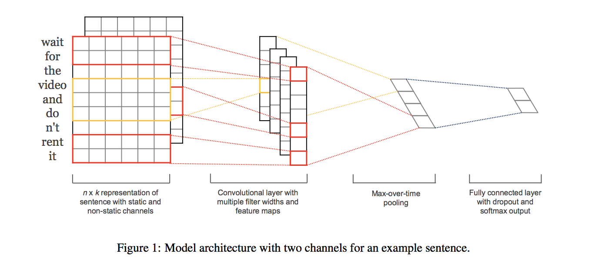

#Convolutional Neural Networks for Sentence Classification

*Yoon Kim* 

[Paper]( https://arxiv.org/pdf/1408.5882v2.pdf)

##Content
1. Report on a series of experiments with convolutional neural networks (CNN) trained on top of pre-trained word vectors for sentence-level classification tasks. (word2vec Google Code)

###Model
1. Below is the model of this paper. We then apply a max-over- time pooling operation (Collobert et al., 2011) over the feature map and take the maximum value cˆ = max{c} as the feature corresponding to this particular filter. 
2. One feature is extracted from one filter. multiple filters (with varying window sizes) to obtain multiple features.
3. These features form the penultimate layer and are passed to a fully connected softmax layer whose output is the probability distribution over labels.

###Regularization
+ Dropout (Good explanation!)

###Model Variations
+ CNN-rand, CNN-static, CNN-non-static, CNN-multichannel

##Accumulate

* penultimate 倒数第二的
* co-adaptation
* discrepancy
* herein 在这个方面
