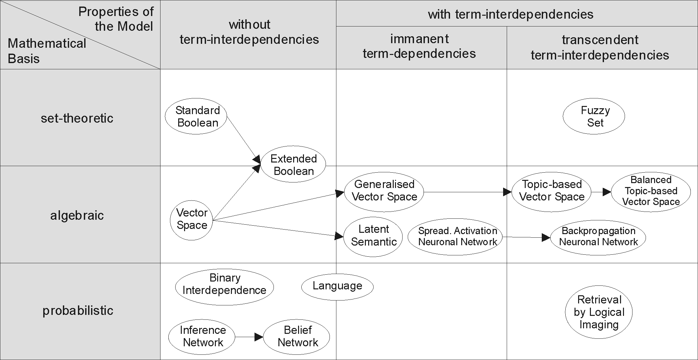
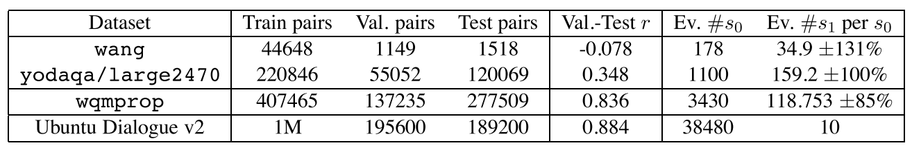

# Project dataset-sts: paper collection

## Basic concepts

Information Retrieval 
[wiki](https://en.wikipedia.org/wiki/Information_retrieval#R-Precision)

+ In the 1960s, the first large information retrieval research group was formed by Gerard Salton at Cornell.
+ Categorization of IR-models

+ Performance and correctness measure
	+ Precision （除以检索文本） 
	+ Recall (除以相关的文本，即答案)
	+ Fall-out
	+ F-score/F-measure
	+ **Average precision**
	+ Precision at K
	+ R-precision
	+ **Mean Average precision** the mean of the average precision scores for each query
	+ Discounted cumulative gain
	+ **Mean reciprocal rank** - The mean reciprocal rank is the average of the reciprocal ranks of results for a sample of queries Q:  the rank position of the first relevant document for the i-th query.
	
## Content

### Model

## Results
### Dataset Size

### [Ubuntu-dialog](http://rover.ms.mff.cuni.cz/~pasky/ubuntu-dialog/)

+ Train set : 1M
+ Val set :  195600
+ Test set : 189200

| Model                    |Time / No.Model | valMRR   | val-2R@1 | val-10R@2 | testMRR  | test-2R@1 | test-10R@2 | settings
|--------------------------|----------|----------|----------|-----------|----------|-----------|------------|---------
| avg                      || 0.636035 | 0.805922 | 0.623185  | 0.639989 | 0.804449  | 0.626524   | ``inp_e_dropout=0`` ``dropout=0``
|                          ||±0.001673 |±0.001594 |±0.001892  |±0.001760 |±0.002325  |±0.002013   |
| DAN                     | 31s/epoch  No.54e02f6d97bdb55d|0.624075 | 0.793207 | 0.606736  | 0.628719 | 0.789763  | 0.611136   | ``inp_e_dropout=0`` ``dropout=0`` ``deep=2`` ``pact='relu'``
|                          ||±0.000384 |±0.000556 |±0.000761  |±0.000576 |±0.000664  |±0.000887   |
| rnn                      | 19043s/epoch  eta = 423 hr ||||||| ``sdim=1`` ``pdim=1`` ``ptscorer=B.dot_ptscorer``
| cnn                      | 2060747s/epoch eta = 45790 hr ||||||| ``pdim=1`` ``ptscorer=B.dot_ptscorer``
| rnncnn                   | 901966s/epoch eta = 20040hr||||||| ``sdim=1/2`` ``pdim=1`` ``ptscorer=B.dot_ptscorer``
| attn1511                 | 198683s/epoch eta = 4420 hr ||||||| ``sdim=1/2`` ``cdim=1/2`` ``ptscorer=B.dot_ptscorer``

These results are obtained like this:

	tools/train.py avg ubuntu data/anssel/ubuntu/v2-trainset.pickle data/anssel/ubuntu/v2-valset.pickle "vocabf='data/anssel/ubuntu/v2-vocab.pickle'" nb_runs=16 inp_e_dropout=0 dropout=0
	tools/eval.py avg ubuntu data/anssel/ubuntu/v2-trainset.pickle data/anssel/ubuntu/v2-valset.pickle data/anssel/ubuntu/v2-testset.pickle weights-ubuntu-avg--69489c8dc3b6ce11-*-bestval.h5 "vocabf='data/anssel/ubuntu/v2-vocab.pickle'" inp_e_dropout=0 dropout=0

### [yodaqa]()

+ Train set : 44648
+ Val set : 1149
+ Test set : 1518

| Model                    |Time  / No.Model    | trainAllMRR | devMRR   | testMAP  | testMRR  | settings
|--------------------------|-------------|-------------|----------|----------|----------|---------
| yodaqakw                 || 0.368773    | 0.337348 | 0.284100 | 0.383238 | (defaults)
| termfreq TF-IDF #w       || 0.339544    | 0.324693 | 0.242700 | 0.337893 | ``freq_mode='tf'``
| termfreq BM25 #w         || 0.483538    | 0.452647 | 0.294300 | 0.484530 | (defaults)
|--------------------------|-------------|-------------|----------|----------|----------|---------
| avg                      |~0s/epoch No.1ea55521db4b976d| 0.332093    | 0.429974 | 0.223231 | 0.311827 | (defaults)
|                          ||±0.004441    |±0.006614 |±0.002166 |±0.003241 |
| DAN                      |~0s/epoch No.18a6a3192e663b40|  0.400680    | 0.477409 | 0.251381 | 0.403253 | ``inp_e_dropout=0`` ``inp_w_dropout=1/3`` ``deep=2`` ``pact='relu'``
|                          || ±0.015806    |±0.011333 |±0.005232 |±0.016799 |
|--------------------------|-------------|-------------|----------|----------|----------|---------
| rnn                      |32s/epoch No.35579388742f9bd0 | 0.307405    | 0.317007 | 0.194494 | 0.296836 | (defaults)
|                          || ±0.016952    |±0.015616 |±0.006009 |±0.011900 |
| cnn                      |5s/epoch No.2506172022443a5| 0.216517    | 0.255667 | 0.170131 | 0.235152 | (defaults)
|                          || ±0.021650    |±0.027517 |±0.009387 |±0.021668 |
| rnncnn                   |25s/epoch No.418051f821c1305a| 0.216062    | 0.262839 | 0.168569 | 0.235880 | (defaults)
|                          ||±0.008533    |±0.018333 |±0.004758 |±0.011267 |
| attn1511                 |24s/epoch No.70372584be6cbee8 | 0.419845    | 0.455612 | 0.270850 | 0.471062 | (defaults)
|                          ||±0.013729    |±0.010906 |±0.005727 |±0.012687 |
|--------------------------|-------------|-------------|----------|----------|----------|---------
| rnn                    | Ubuntu transfer learning (``ptscorer=B.dot_ptscorer`` ``pdim=1`` ``inp_e_dropout=0`` ``dropout=0`` ``balance_class=True`` ``adapt_ubuntu=True`` ``vocabt='ubuntu'`` ``opt='rmsprop'``)
| avg + BM25               |
| DAN + BM25               | ``inp_e_dropout=0`` ``inp_w_dropout=1/3`` ``deep=2`` ``pact='relu'``
| rnn + BM25               |
| cnn + BM25               |
| rnncnn + BM25            |
| attn1511 + BM25          |

These results are obtained like this:

	tools/train.py avg anssel data/anssel/yodaqa/curatedv2-training.csv data/anssel/yodaqa/curatedv2-val.csv nb_runs=16
	tools/eval.py avg anssel data/anssel/yodaqa/curatedv2-training.csv data/anssel/yodaqa/curatedv2-val.csv data/anssel/yodaqa/curatedv2-test.csv weights-anssel-avg--69489c8dc3b6ce11-*-bestval.h5
	

####large2470:

| Model                    |Time / No.Model | trainAllMRR | devMRR   | testMAP  | testMRR  | settings
|--------------------------|-------------|-------------|----------|----------|----------|---------
| yodaqakw                 || 0.332693    | 0.318246 | 0.303900 | 0.376465 | (defaults)
| termfreq TF-IDF #w       || 0.325390    | 0.328255 | 0.266800 | 0.362613 | ``freq_mode='tf'``
| termfreq BM25 #w         || 0.441573    | 0.432115 | 0.313900 | 0.490822 | (defaults)
|--------------------------|-------------|-------------|----------|----------|----------|---------
| avg                      |2s/epoch  No.41baba12244f2b0e|0.365213    | 0.384023 | 0.264375 | 0.383345 | (defaults)
|                          ||±0.005987    |±0.005006 |±0.003504 |±0.006657 |
| DAN                      |2s/epoch No.63444cb491d5c58b| ``inp_e_dropout=0`` ``inp_w_dropout=1/3`` ``deep=2`` ``pact='relu'``
|                          ||--------------------------|-------------|-------------|----------|----------|----------|---------
| rnn                      || (defaults)
| cnn                      || ``inp_e_dropout=1/2`` ``dropout=1/2`` (FIXME)
| rnncnn                   || (defaults)
| attn1511                 | (defaults)
|--------------------------|-------------|-------------|----------|----------|----------|---------
| Ubu. rnn                 | Ubuntu transfer learning (``ptscorer=B.dot_ptscorer`` ``pdim=1`` ``inp_e_dropout=0`` ``dropout=0`` ``balance_class=True`` ``adapt_ubuntu=True`` ``opt='rmsprop'``)
|--------------------------|-------------|----------|----------|----------|---------
| avg + BM25               | 
| DAN + BM25               || ``inp_e_dropout=0`` ``inp_w_dropout=1/3`` ``deep=2`` ``pact='relu'``
| rnn + BM25               | 
| cnn + BM25               | 
| rnncnn + BM25            | 
| attn1511 + BM25          | |--------------------------|-------------|----------|----------|----------|---------
| Ubu. rnn + BM25          | | Ubuntu transfer learning (``ptscorer=B.mlp_ptscorer`` ``pdim=1`` ``inp_e_dropout=0`` ``dropout=0`` ``balance_class=True`` ``adapt_ubuntu=True`` ``opt='rmsprop'`` ``epoch_fract=1``)
| SNLI rnn + BM25          | | SNLI transfer learning (``dropout=0`` ``inp_e_dropout=0`` ``balance_class=True`` ``opt='rmsprop'`` ``epoch_fract=1``)

These results are obtained like this:

	tools/train.py avg anssel data/anssel/yodaqa/large2470-training.csv data/anssel/yodaqa/large2470-val.csv nb_runs=16
	tools/eval.py avg anssel data/anssel/yodaqa/large2470-training.csv data/anssel/yodaqa/large2470-val.csv data/anssel/yodaqa/large2470-test.csv weights-anssel-avg--69489c8dc3b6ce11-*-bestval.h5

BM25 results are obtained with:

	"prescoring='termfreq'" "prescoring_weightsf='weights-anssel-termfreq-3368350fbcab42e4-bestval.h5'" "prescoring_input='bm25'" "f_add=['bm25']" prescoring_prune=20

Transfer learning has been performed like this:

	tools/transfer.py rnn ubuntu data/anssel/ubuntu/v2-vocab.pickle ubu-weights-rnn--23fa2eff7cda310d-bestval.h5 anssel data/anssel/yodaqa/curatedv2-training.csv data/anssel/yodaqa/curatedv2-val.csv pdim=1 ptscorer=B.dot_ptscorer dropout=0 inp_e_dropout=0 balance_class=True adapt_ubuntu=True "opt='rmsprop'" nb_runs=16
	tools/eval.py rnn anssel data/anssel/yodaqa/curatedv2-training.csv data/anssel/yodaqa/curatedv2-val.csv data/anssel/yodaqa/curatedv2-test.csv weights-ubuntu-anssel-rnn-1cd9ebbf9c99f926-*-bestval.h5 "vocabf='data/anssel/ubuntu/v2-vocab.pickle'" "vocabt='ubuntu'" pdim=1 ptscorer=B.dot_ptscorer inp_e_dropout=0 dropout=0 balance_class=True adapt_ubuntu=True "opt='rmsprop'"

where the ubu-weights model can be downloaded from

	http://pasky.or.cz/dev/brmson/ubu-weights-rnn--23fa2eff7cda310d-bestval.h5

### [Wang](https://code.google.com/p/jacana/)
The classic academic standard stems from the TREC-based dataset originally by Wang et al., 2007, in the form by Yao et al., 2013 

+ Train set : 44648
+ Val set : 1149
+ Test set : 1518

| Model                    |Time  / No.Model    | trainAllMRR | devMRR   | testMAP  | testMRR  | settings
|--------------------------|----------------|-------------|----------|----------|----------|---------
| termfreq TF-IDF #w       || 0.714169    | 0.725217 | 0.578200 | 0.708957 | ``freq_mode='tf'``
| termfreq BM25 #w         | |0.813992    | 0.829004 | 0.630100 | 0.765363 | (defaults)
| Tan (2015)               | |           |          | 0.728    | 0.832    | QA-LSTM/CNN+attention; state-of-art 2015
| dos Santos (2016)        | |            |          | 0.753    | 0.851    | Attentive Pooling CNN; state-of-art 2016
| Wang et al. (2016)       | |            |          | 0.771    | 0.845    | Lexical Decomposition and Composition; state-of-art 2016
|--------------------------|-------------|----------|----------|----------|---------
| avg                      |4s/epoch| 0.819778    | 0.869590 | 0.658770 | 0.751929 | (defaults)
|                          ||±0.005699    |±0.006494 |±0.007244 |±0.009579 |
| DAN.                     ||0.819778    | 0.869590 | 0.658770 | 0.751929 | ``inp_e_dropout=`` ``inp_w_dropout=1/3`` ``deep=2`` ``pact='relu'``
|                          ||±0.005699    |±0.006494 |±0.007244 |±0.009579 |
|--------------------------|-------------|----------|----------|----------|---------
| rnn                      |22s/epoch  No.5d241268d513bada| 0.838135    | 0.844555 | 0.693467 | 0.780089 | (defaults)
|                          ||±0.045370    |±0.008753 |±0.033851 |±0.028084 |
| cnn                      | 3s/epoch No.3166a0bfd4ea426e| 0.465275    | 0.630186 | 0.488169 | 0.566501 | (defaults)
|                          ||±0.085380    |±0.063493 |±0.045296 |±0.053307 |
| rnncnn                   | 17s/epoch No.48a6bd17e9a932f7| 0.539957    | 0.692048 | 0.552856 | 0.635640 | (defaults)
|                          ||±0.052861    |±0.030235 |±0.033240 |±0.034747 |
| attn1511                 | 17s/epoch No.353f0736c5245b72  | 0.879860    | 0.890741 | 0.710250 | 0.794669 | (defaults)
|                          ||±0.031631    |±0.066553 |±0.107366 |±0.162406 |
|--------------------------|-------------|----------|----------|----------|---------
| Ubu. rnn                 | ||||| Ubuntu transfer learning (``ptscorer=B.dot_ptscorer`` ``pdim=1`` ``inp_e_dropout=0`` ``dropout=0`` ``balance_class=True`` ``adapt_ubuntu=True`` ``opt='rmsprop'``)
|                          | |||||
|--------------------------|-------------|----------|----------|----------|---------
| avg + BM25               | ||||| 
|                          | |||||
| DAN + BM25               | ||||| ``inp_e_dropout=0`` ``inp_w_dropout=1/3`` ``deep=2`` ``pact='relu'``
|                          | |||||
| rnn + BM25               | |||||
|                          | |||||
| cnn + BM25               | |||||
|                          | |||||
| rnncnn + BM25            | |||||
|                          | |||||
| attn1511 + BM25          | |||||
|                          | |||||

These results are obtained like this:

	tools/train.py avg anssel data/anssel/wang/train-all.csv data/anssel/wang/dev.csv nb_runs=16
	tools/eval.py avg anssel data/anssel/wang/train-all.csv data/anssel/wang/dev.csv data/anssel/wang/test.csv weights-anssel-avg--69489c8dc3b6ce11-*-bestval.h5

BM25 results are obtained with:

	"prescoring='termfreq'" "prescoring_weightsf='weights-anssel-termfreq-3368350fbcab42e4-bestval.h5'" "prescoring_input='bm25'" "f_add=['bm25']" prescoring_prune=20

## Accumulate

* immanent 天生的，内在的 term-dependencies
* transcendent 超然的 term-interdependencies 
* fuzzy set 毛茸茸的，含混不清的
* wiggle 摇动
* interpolated 插入的
