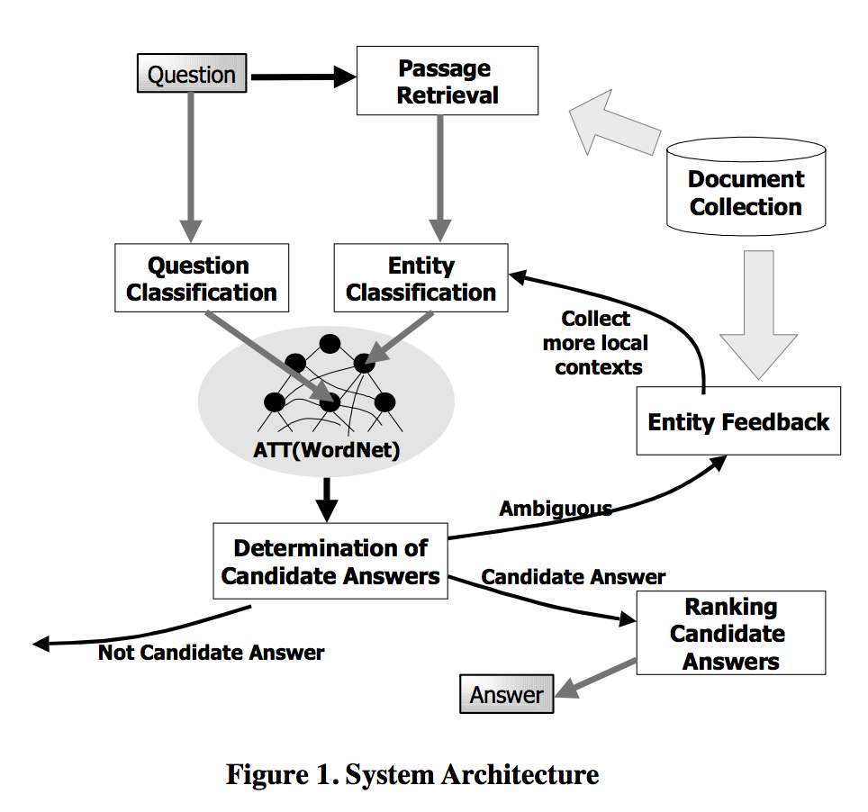
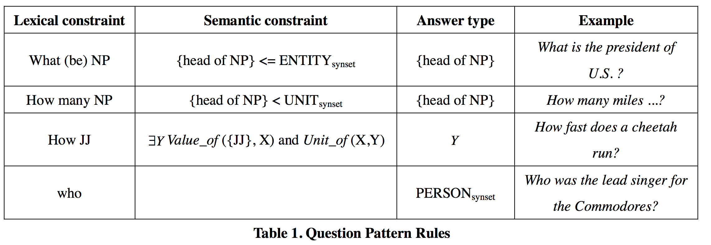
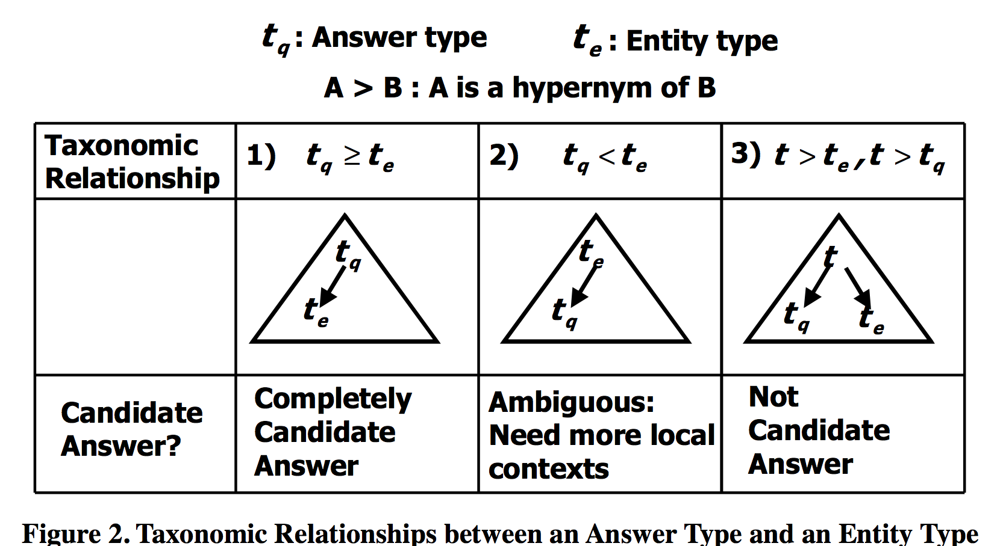
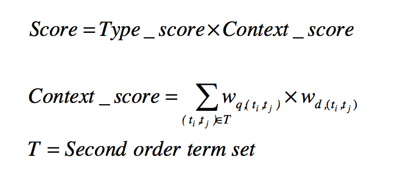

# Question Answering Approach Using a WordNet-based Answer Type Taxonomy

*Seung-Hoon Na, In-Su Kang, Sang-Yool Lee, Jong-Hyeok Lee* 

[Paper](http://citeseerx.ist.psu.edu/viewdoc/summary?doi=10.1.1.14.1745) 2002

## Content
+ QA System Architecture

### 1. Question Classification
+ The NP-chunker was designed by a simple rule-based scheme. After chunking, question pattern rules are applied to the question to determine an answer type of a question.

### 2. Passage Retrieval
+ Passage Retrieval consists of two processing steps: document retrieval and passage ranking. 

### 3. Entity Classification
1. access entity database
2. Otherwise, the entity is looked up in WordNet
3. If the entity is not found even in WordNet, a clue word related to the entity is searched within the document containing the entity.

### 4. Determination of Candidate Answers

+ Definition: the answer type of the question and the entity type of the candidate answer
+ The first is the case where the answer type is a hypernym of an entity type.---e.g. answer type is PERSONsynset and an entity type is ENGINEERsynset. Then, since PERSONsynset is a hypernym of ENGINEERsynset, the entity becomes a candidate answer.

### 5. Ranking of Candidate Answers

After recognizing candidate answers, each candidate answer is ranked by the formula.

## Accumulate

* Ad-Hoc（点对点）
* Answer type taxonomy (ATT)问题分类
* ontological 分类学
