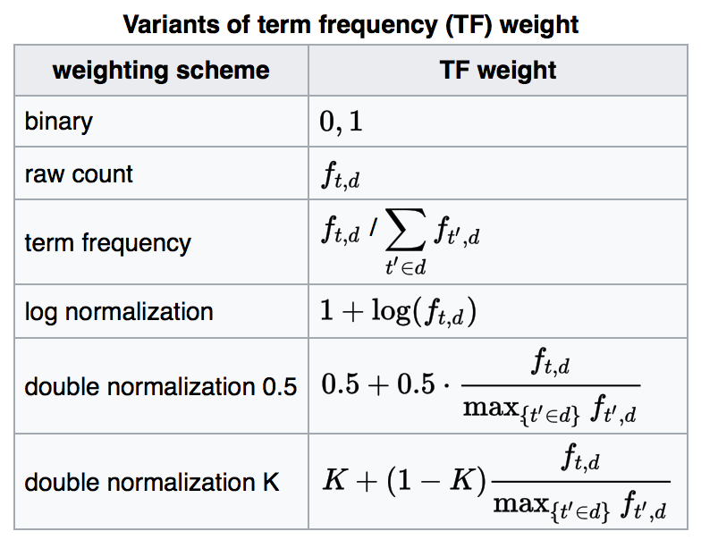
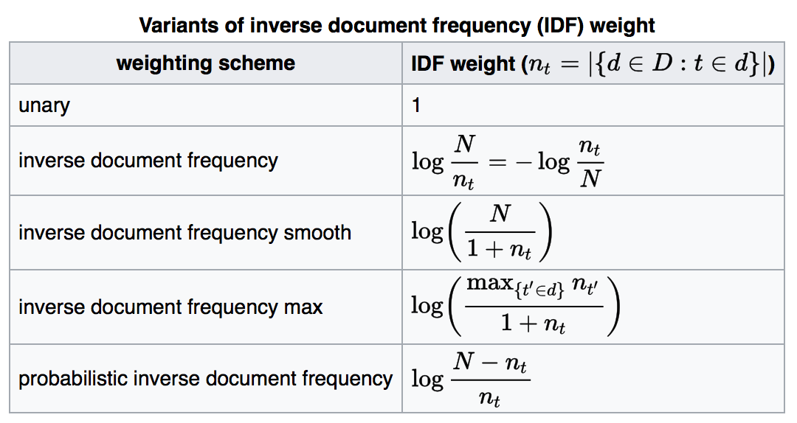
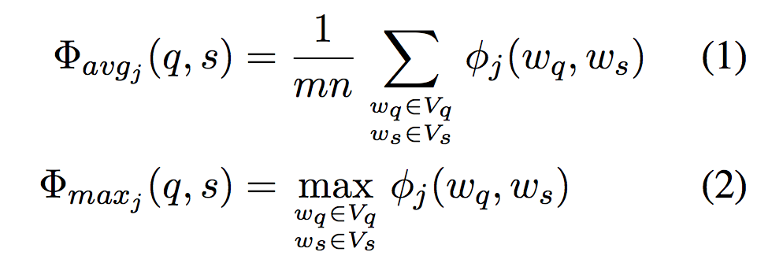

# Question Answering Using Enhanced Lexical Semantic Models

*Wen-tau Yih Ming-Wei Chang Christopher Meek Andrzej Pastusiak* 

[Paper](http://aclweb.org/anthology/P/P13/P13-1171.pdf) 2013

## Content

+ The key subtasks – **answer sentence selection**. Given a question and a set of candidate sentences, the task is to choose the correct sen- tence that contains the exact answer and can suf- ficiently support the answer choice. 
+ **tf–idf** a numerical statistic that is intended to reflect how important a word is to a document in a collection or corpus. It is the product of two statistics, term frequency and inverse document frequency. 
	+ Term frequency
		+ the simplest choice is to use the raw count of a term in a document

		

		
		

	+ Inverse document frequency
		+  a measure of how much information the word provides, that is, whether the term is common or rare across all documents. 

		

		
		

### The enhanced lexical semantic models
*Goal* : To go beyond the simple, limited surface-form matching

*Method* :
Pair words that are semantically related, specifically measured by models of word relations including synonymy/antonymy, hypernymy/hyponymy (the Is-A relation) and general semantic word similarity.

+  **Synonymy and Antonymy**
	1. Each row consists of a group of synonyms and antonyms of a particular sense and each column represents a unique word. Values of the elements in each row vector are the TFIDF values of the corresponding words in this group. 
	2. SVD decomposition 

	3. if the cosine score of two col- umn vectors are positive, then the two corresponding words tend to be synonymous; if it’s negative, then the two words are antonymous.  

	+ SVD分解通过中间的对角矩阵进行了降维去噪

	+ 判断同义词和反义词相当于换了一个坐标的维度，然后看cosine距离。

+ **Hypernymy and Hyponymy**

	Augment WordNet with the Is-A relations found in Probase (Wu et al., 2012).

+ **Semantic Word Similarity**

	Leverage three different VSMs(vector space models) in this work: Wiki term-vectors, recurrent neural network language model (RNNLM) and a concept vector space model learned from click-through data. 

### Learning QA Matching Models
+  **Bag-of-Words Model** lack of structure information
	
	

		
	

Two learning algorithms in this set- ting: logistic regression and boosted decision trees (Friedman, 2001). 

+  **Learning Latent Structures**
	+ learning constrained latent representations (LCLR) (Chang et al., 2010). 
	+ SVM

## Accumulate

* quasisynchronous 准同步
* factoid 仿真陈述的
* semantic 语义的
* syntactic 语法的
* thesaurus 同义词词典
* Hypernymy 语义联系 
* Hyponymy 词义的上下义关系
* intriguing 有趣的
* linguistic 语言学的
* variant 变体