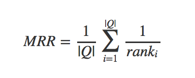

# Sentence Pair Scoring: Towards Unified Framework for Text Comprehension

*Petr Baudisˇ, Jan Pichl, Toma ́sˇ Vyskocˇil and Jan Sˇedivy ́* 

[Paper](http://arxiv.org/abs/1603.06127) 2016 Experimental 

## Content

+ propose new baselines by comparing the performance of common IR metrics and popular convolutional, recurrent and attention-based neural models across many Sentence Pair Scoring tasks and datasets.
+ high reusability, easy extensions 
+ the RNN-CNN model or transfer learning based on the Ubu. RNN model is better.

### Tasks
+ Answer Sentence Selection 

	+ Evaluation: Mean Average Precision (MAP) and Mean Reciprocial Rank (MRR)
	+ 
	

+ Next Utterance Ranking

+ Recognizing Textual Entailment and Semantic Textual Similarity
	+ Given a pair of a factual sentence and a hypothesis sentence, we are to determine whether the hypothesis represents a contradiction, entailment or is neutral	
	+ Two current popular machine learning datasets for this task. 
		+ The Stanford Natural Language Inference SNLI dataset (Bowman et al., 2015): 570k English sentence pairs with the facts based on image captions, and 10k + 10k of the pairs held out as validation and test sets. 
		+ The SICK-2014 dataset (Marelli et al., 2014): it is geared at specifically benchmarking semantic compositional methods, aiming to capture only similarities on purely language and common knowledge level, without relying on domain knowledge, and there are no named entities or multi-word idioms; it consists of 4500 training pairs, 500 validation pairs and 4927 testing pairs.

### Model
+ Baseline 
	+ Weighed word overlaps metrics TF-IDF and BM25 (Robertson et al., 1995)
	+ The avg metric - using word embeddings that proved success-
ful e.g. in (Yu et al., 2014) or (Weston et al., 2014)

+ Recurrent Neural Networks
	+ a bidirectional network (Cho et al., 2014) (Tan et al., 2015) (Lowe et al., 2015) (Bowman et al., 2015)

+ Convolutional Neural Networks
	+ We apply a multi-channel convolution (Kim, 2014) with single-token channel of N convolutions and 2, 3, 4 and 5-token channels of N/2 convolu- tions each, relu transfer function, max-pooling over the whole sentence, and as above a projec- tion to shared space and an MLP scorer. Dropout is not applied.

+ RNN-CNN Model
	+ Inspired by (Tan et al., 2015), the aim of this model is to allow the RNN to model long-term dependencies and model contextual rep- resentations of words, while taking advantage of the CNN and pooling operation for crisp selection of the gist of the sentence. 	

+ Attention-Based Models
	+  the (Tan et al., 2015) model attn1511
 
### Experiment setting
+ Embedding: N = 300 dimensional GloVe embed- dings matrix pretrained on Wikipedia 2014 + Gi- gaword 5
+ heavy overfitting as training progresses and rarely use a model from later than a couple of epochs.

### Evaluation Methodology
+ Randomness
	+ randomized weight initialization
	+ stochastic dropout
		+ empirical standard deviation of 0.02 

## Accumulate

* discern 
* Entailment 蕴涵