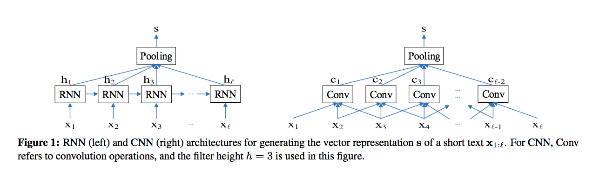

# Sequential Short-Text Classification with Recurrent and Convolutional Neural Networks

*Ji Young Lee*, *Franck Dernoncourt* 

[Paper](https://arxiv.org/pdf/1603.03827.pdf) 2016

## Content

### Related work
#### Short-text classfication
+ Support Vector Machines (SVMs) with rule-based features (Joao Silva, Lu ́ısa Coheur, Ana Cristina Mendes, and Andreas Wichert. 2011. From symbolic to sub-symbolic information in question classification. Artificial Intelligence Review, 35(2):137–154.)
+ combining SVMs with naive Bayes (Wang and Manning, 2012)
+ building dependency trees with Conditional Random Fields (Nakagawa et al., 2010)
+ convolutional neural networks (CNNs) (Kim, 2014; Blunsom et al., 2014; Kalchbrenner et al., 2014) 
+ recursive neural net- works (Socher et al., 2012)

#### Sequential short-text classification
+ Hidden Markov Models (HMMs) (Reithinger and Klesen, 1997), (Stolcke et al., 2000)
+ maximum en- tropy (Ang et al., 2005)
+ naive Bayes (Lendvai and Geertzen, 2007)

### Model
Two part model:

1. Short-text representation.

	A given short text of length l :
	
	+ RNN representation 
	

	
	

	+ CNN representation 
	

	
	

	Then the max pooling.
	
2. Classify the current short text based on the vector representations of the current. 
	
	The history size means the dimension cut by the two layers.
		
	+ FF(feedward) + tanh equals to FF1
	
	

		
	
	
	
	+ FF + softmax
	
	

			

	
3. Comparsion:

	

		
	

## Accumulate

* artificial neural networks (ANNs)
* pragmatic 务实的
* semantic 语义的
* syntactic 句法的
* hyperbolic tangent function 双曲正切函数
* conversely 相反的