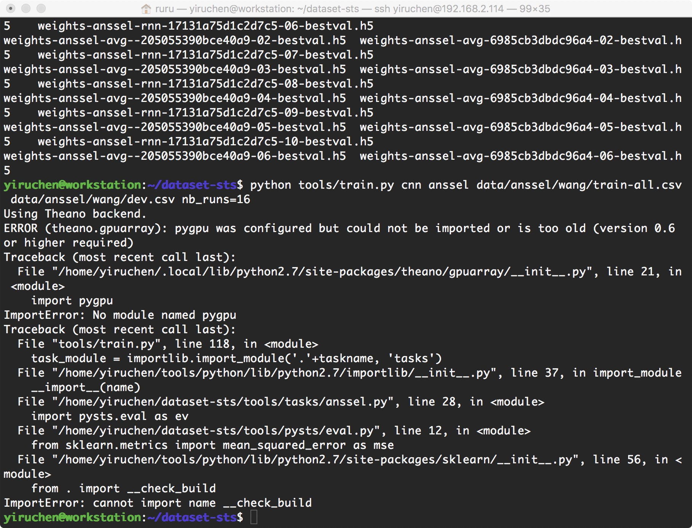

# dataset-sts 运行问题

**陈一茹 chen1ru@pku.edu.cn**

## 环境
+ Github 链接：https://github.com/Ireneruru/dataset-sts/tree/master/data/anssel/wang
+ 已经安装好的
	+ keras 0.3.2 
	+ theano 
	+ python的虚拟环境：
		+ pip安装的包在/home/yiruchen/.local/lib/python2.7/site-packages
		+ 另一部分在/home/yiruchen/tools/python/lib/python2.7

## 遇到的问题：
* 在文件夹/home/yiruchen/dataset-sts下运行：
	``python tools/train.py cnn anssel data/anssel/wang/train-all.csv data/anssel/wang/dev.csv nb_runs=16``
	会报出下图的错误，疑似python包的路径混乱了。
* 目的：实现指定GPU运行代码的功能，可以同时利用起多个GPU。

